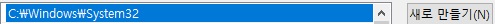

# live server 실행 시 브라우저가 열리지 않는 현상 해결법

vscode에서 live server 실행 시 실행 메세지는 뜨지만 브라우저가 열리지 않을 때 해결 방법 (환경변수 설정이 손상 된 경우)

환경변수 편집

환경변수 클릭

시스템 속성 path 클릭 > 편집 클릭

새로만들기 클릭 후 위 경로를 추가해준다.

저장 후에 다시시작하니 브라우저가 잘 열린다!